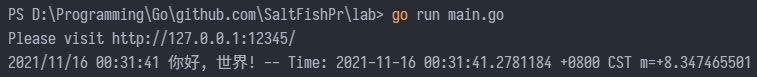

<!--more-->

## 简介

[Go](https://github.com/golang/go) 是 Google 开发的一种静态强类型、编译型、并发型，并具有垃圾回收功能的编程语言。于 2009 年 11 月正式宣布推出，1.0 版本在 2012 年 3 月发布。之后，Go 广泛应用于 Google 的产品以及许多其他组织和开源项目。Go 程序员常常被称为地鼠（gopher），因此地鼠也是 Go 的吉祥物。


在 Go 语言出现之前，开发者们总是面临非常艰难的抉择，究竟是使用执行速度快但是编译速度并不理想的语言（如：C++），还是使用编译速度较快但执行效率不佳的语言（如：.NET、Java），或者说开发难度较低但执行速度一般的动态语言呢？显然，Go 语言在这 3 个条件之间做到了最佳的平衡：快速编译，高效执行，易于开发。

特性：

- 为并发设计：协程（goroutine）、通道（channel）、同步原语（标准库 sync 包）：
- 节省内存、程序启动快和代码执行速度快
- 良好的跨平台性
- 开源

其它吸引我的地方：

- 25 个保留关键字，学习快，上手快
- go 工具链，提供构建、执行、依赖管理、代码检查、代码格式化等功能
- 代码可读性高，大家代码风格一致

## Hello World

只使用标准库构建 http 服务。

Hello World 向每个访问的客户端打印中文的“你好，世界!”和当前的时间信息。

```go
package main

import (
	"fmt"
	"log"
	"net/http"
	"time"
)

func main() {
	fmt.Println("Please visit http://127.0.0.1:12345/")
	http.HandleFunc("/", func(w http.ResponseWriter, req *http.Request) {
		s := fmt.Sprintf("你好, 世界! -- Time: %s", time.Now().String())
		fmt.Fprintf(w, "%v\n", s)
		log.Printf("%v\n", s)
	})
	if err := http.ListenAndServe(":12345", nil); err != nil {
		log.Fatal("ListenAndServe: ", err)
	}
}
```

运行 Hello World：




## 性能比较

[CPU 密集型工作负载](https://benchmarksgame-team.pages.debian.net/benchmarksgame/fastest/go.html)：正则表达式计算

- 四核 3.0GHz Intel®i5-3330® CPU
- 15.8 GiB RAM
- 2TB SATA 磁盘驱动器
- Ubuntu™ 21.04 x86_64 GNU/Linux 5.11.0-18-generic

| 语言  | 运行时间 | 使用内存 (byte) | 源码大小 (byte) | 总执行时间 |    cpu 负载     |
| :---: | :------: | :-------------: | :-------------: | :--------: | :-------------: |
|  Go   |   3.85   |     324,200     |       810       |    6.01    | 27% 19% 20% 91% |
| Java  |   5.31   |     793,572     |       929       |   17.50    | 79% 78% 83% 89% |

[web 框架对比](https://www.techempower.com/benchmarks/#section=data-r20&hw=ph&test=composite)：Java(Spring) vs Go(Fiber)

测试内容包括 JSON 序列化 (JSON)、单查询 (1-query)、数据更新 (Updates) 和纯文本返回 (Plaintext) 的峰值性能，单位 `response/second` 。以及响应时延。

物理机器：

- Intel® Xeon Gold 5120 CPU
- 32 GB 内存
- 企业级 SSD
- 思科万兆以太网交换机

| Framework | 返回 json | 单查询  | 数据更新 | 返回纯文本 | 平均时延 | 最大时延 |
| :-------: | :-------: | :-----: | :------: | :--------: | :------: | :------: |
|   fiber   | 1,317,695 | 395,902 |  11,806  | 6,413,651  |  0.8ms   |  20.3ms  |
|  spring   |  150,259  | 127,114 |  10,498  |  183,737   |  14.3ms  | 128.1ms  |

云上部署：

- Microsoft Azure D3v2 实例
- 千兆以太网

| Framework | 返回 json | 单查询 | 数据更新 | 返回纯文本 | 平均时延 | 最大时延 |
| :-------: | :-------: | :----: | :------: | ---------- | :------: | :------: |
|   fiber   |  167,451  | 52,125 |  1,888   | 1,135,808  |  0.7ms   |  17.2ms  |
|  spring   |  20,140   | 18,899 |  1,420   | 28,780     |  11.0ms  | 248.9ms  |

## Go 工具链安装与简介

windows 环境下：[下载](https://golang.google.cn/)安装文件并运行。

### 检测安装

输入：

```shell
go version
```

输出：

```text
go version go1.17.2 linux/arm64
```

### 工具介绍

- go run: 编译并运行文件/包
- go build: 编译生成可执行文件（默认当前平台当前架构）
- go get: 从远程拉取包
- go mod：依赖管理
- go install: 编译生成可执行文件并将其移动到 `$GOPATH/bin` 中，可以是远程包
- go test: 执行测试
- go fmt: 代码格式化
- go vet: 代码检查
- go env: 查看/设置 Go 环境变量

## Go 基础

### 25 个关键字

- package, import, const, var, type, func 用来声明各种代码元素
- interface, chan, map 和 struct 用做 一些组合类型的字面表示中
- break, case, continue, default, else, fallthrough, for, goto, if, range, return, select 和 switch 用在流程控制语句中
- defer 和 go 也可以看作是流程控制关键字

### 类型系统

#### 基本类型

- 字符串：string
- 布尔：bool
- 数值：
  - uint8(byte), uint16, uint32, uint64, int8, int16, int32(rune), int64
  - float32, float64
  - complex64, complex128

uintptr、int 以及 uint 类型的值的尺寸依赖于具体编译器实现。在 64 位的架构上，int 和 uint 类型的值是 64 位的；在 32 位的架构上，它们是 32 位的。编译器必须保证 uintptr 类型的值的尺寸能够存下任意一个内存地址。

#### 组合类型

- 指针类型
- 结构体类型
- 函数类型
- 容器类型
  - 数组：定长容器
  - 切片：动态长度容器
  - 映射：又称字典类型，在标准编译器中映射是使用哈希表实现的
- 通道类型
- 接口类型

### 一个简单的栗子

数据类型，常量、变量声明，流程控制语句

```go
// 单行注释
/* 多行
   注释 */

// 导入包的子句在每个源文件的开头。
// main 比较特殊，它用来声明可执行文件，而不是一个库。
package main

// import 语句声明了当前文件引用的包。
import (
	"fmt" // Go 语言标准库中的包
	"os" // 系统底层函数，如文件读写
)

// main 是程序执行的入口。
func main() {
	// 向标准输出打印一行。
	fmt.Println("Hello, 世界")

	// 调用当前包的另一个函数。
	beyondHello()
}

// 声明函数`func functionName(parameter type, [parameter type]) ([resultValue] type, [[resultValue] type]) { body }`。
func beyondHello() {
	var x int // 变量声明，变量必须在使用之前声明。
	x = 3     // 变量赋值。
	y := 4    // 可以用:=来偷懒，它把变量类型、声明和赋值都搞定了。

	fmt.Println("x:", x, "y:", y) // 简单输出。

	learnTypes()
}

// 内置变量类型和关键词。
func learnTypes() {
	str := "少说话多读书！" // String 类型。
	s2 := `这是一个
可以换行的字符串` // 同样是 String 类型。

	// 非 ascii 字符。Go 使用 UTF-8 编码。
	g := 'Σ' // rune 类型

	f := 3.14195 // float64 类型，IEEE-754，64 位浮点数。
	c := 3 + 4i  // complex128 类型，内部使用两个 float64 表示。

	// Var 变量可以直接初始化
	var u uint = 7 // unsigned 无符号变量，但是实现依赖 int 型变量的长度。
	var pi float32 = 22. / 7

	// 字符转换
	n := byte('\n') // byte 是 uint8 的别名。

	// 数组（array）类型的大小在编译时即确定。
	a3 := [...]int{3, 1, 5} // 有 3 个 int 变量的数组，同时进行了初始化。
	var a4 [4]int           // 有 4 个 int 变量的数组，初始为 0。

	// 切片（slice）的大小是动态的，它的长度可以按需增长。
	// 用内置函数 append() 向切片末尾添加元素。
	s := []int{1, 2, 3}    // 这是个长度 3 的 slice。
	s = append(s, 4, 5, 6) // 再加仨元素，长度变为 6 了。
	fmt.Println(s)         // 更新后的数组是 [1 2 3 4 5 6]。

	// array 和 slice 各有所长，但是 slice 可以动态的增删，所以更多时候还是使用 slice。
	s3 := []int{4, 5, 9}    // 这里没有省略号。
	s4 := make([]int, 4)    // 分配 4 个 int 大小的内存并初始化为 0。
	var d2 [][]float64      // 这里只是声明，并未分配内存空间。
	bs := []byte("a slice") // 进行类型转换。

	// 除了向 append() 提供一组原子元素（写死在代码里的）以外，我们
	// 还可以用如下方法传递一个 slice 常量或变量，并在后面加上省略号，
	// 用以表示我们将引用一个 slice、解包其中的元素并将其添加到 s 数组末尾。
	s = append(s, []int{7, 8, 9}...) // 第二个参数是一个 slice 常量。
	fmt.Println(s)                   // 更新后的数组是 [1 2 3 4 5 6 7 8 9]

	p, q := learnMemory() // 声明 p, q 为 int 型变量的指针。
	fmt.Println(*p, *q)   // * 取值

	// Map 是动态可增长关联数组，和其他语言中的 hash 或者字典相似。
	m := map[string]int{"three": 3, "four": 4}
	m["one"] = 1

	// 在 Go 语言中未使用的变量在编译的时候会报错，而不是 warning。
	// 空标识符 _ 可以使你“使用”一个变量。
	_, _, _, _, _, _, _, _, _, _ = str, s2, g, f, u, pi, n, a3, s4, bs
	// 通常的用法是，在调用拥有多个返回值的函数时，用下划线抛弃其中的一个参数。
	// 调用 os.Create 并用下划线变量扔掉它的错误代码，因为我们觉得这个文件一定会成功创建。
	file, _ := os.Create("output.txt")
	fmt.Fprint(file, "这句代码还示范了如何写入文件呢")
	file.Close() // 写完后关闭文件。

	// 输出变量
	fmt.Println(s, c, a4, s3, d2, m)

	learnFlowControl()
}

// Go 全面支持垃圾回收。Go 有指针，但是不支持指针运算。
func learnMemory() (p, q *int) {
	p = new(int) // 定义一个指向 int 类型的指针，空值为 nil。

	s := make([]int, 20) // 给 20 个 int 变量分配一块内存

	s[3] = 7 // 给 slice 内的元素赋值
	r := -2  // 声明一个局部变量

	return &s[3], &r // & 取地址，p 为 s 的第 4 个元素的地址，q 为 r 的地址。
}

func learnFlowControl() {
	// if 需要花括号，括号就免了。
	if true {
		fmt.Println("这句话肯定被执行")
	}

	// 如果太多嵌套的 if 语句，推荐使用 switch。
	x := 1
	switch x = 1; x { // 在头部添加赋值表达式。
	case 0:
		// 隐式调用 break 语句，匹配上一个即停止。
	case 1:
		fallthrough // 如果想继续向下执行，需要加上 fallthrough 语句。
	case 2:
		// 继续执行。
	}

	// 和 if 一样，for 也不用括号。
	for x := 0; x < 3; x++ { // ++ 自增。
		fmt.Println("遍历", x) // 内部的 x 覆盖了外部的 x。
	}

	// for 是 go 里唯一的循环关键字，不过它有很多变种。
	for {
		break    // 跳出。
		continue // 继续下一个循环，这里不会运行。
	}

	// 用 range 可以枚举 array、slice、string、map、channel 等不同类型。
	for key, value := range map[string]int{"one": 1, "two": 2, "three": 3} {
		// 打印 map 中的每一个键值对。
		fmt.Printf("索引：%s, 值为：%d\n", key, value)
	}
	// 如果你只想要值，那就用前面讲的下划线扔掉不用的值。
	for _, name := range []string{"Bob", "Bill", "Joe"} {
		fmt.Printf("你是。。 %s\n", name)
	}

	// 和 for 一样，在头部添加赋值表达式给 y 赋值，然后再和 x 作比较。
	if y := expensiveComputation(); y > x {
		x = y
	}
	// 闭包函数。
	xBig := func() bool {
		return x > 100 // x 是上面声明的变量引用。
	}
	fmt.Println("xBig:", xBig()) // true（上面把 y 赋给 x 了）。
	x /= 1e5                     // x 变成 10。
	fmt.Println("xBig:", xBig()) // 现在是 false。

	// 除此之外，函数体可以在其他函数中定义并调用，
	// 满足下列条件时，也可以作为参数传递给其他函数：
	//   a) 定义的函数被立即调用。
	//   b) 函数返回值符合调用者对类型的要求。
	fmt.Println("两数相加乘二：",
		func(a, b int) int {
			return (a + b) * 2
		}(10, 2)) // 传入 10, 2 两个参数。

	// 当你需要 goto 的时候，你会爱死它的。
	// break 和 continue 同样可以带 label。
	goto love
love:
	return
}

func expensiveComputation() int {
	return 1e6
}
```

### 包（package）

Go 使用代码包（package）来组织管理代码。我们必须先引入一个代码包（除了 builtin 标准库包）才能使用其中导出的资源（比如函数、类型、变量和有名常量等）。

代码包目录的名称并不要求一定要和其对应的代码包的名称相同。但是，库代码包目录的名称最好设为和其对应的代码包的名称相同。因为一个代码包的引入路径中包含的是此包的目录名，但是此包的默认引入名为此包的名称。如果两者不一致，会使人感到困惑。

在我们创建一个新项目时，只需要项目文件夹执行 `go mod init <project name>`，即可使用 go mod 管理依赖


之后就可以使用 `go get` 拉取远程包，或使用 `go mod tidy` 一键处理依赖。

#### 标准库概述

- unsafe: 包含了一些打破 Go 语言“类型安全”的命令，一般的程序中不会被使用，可用在 C/C++ 程序的调用中。
- syscall-os-os/exec:
  - os: 提供给我们一个平台无关性的操作系统功能接口，采用类 Unix 设计，隐藏了不同操作系统间的差异，让不同的文件系统和操作系统对象表现一致。
  - os/exec: 提供我们运行外部操作系统命令和程序的方式。
  - syscall: 底层的外部包，提供了操作系统底层调用的基本接口。
- archive/tar 和 /zip-compress：压缩（解压缩）文件功能。
- fmt-io-bufio-path/filepath-flag:
  - fmt: 提供了格式化输入输出功能。
  - io: 提供了基本输入输出功能，大多数是围绕系统功能的封装。
  - bufio: 缓冲输入输出功能的封装。
  - path/filepath: 用来操作在当前系统中的目标文件名路径。
  - flag: 对命令行参数的操作。
- strings-strconv-unicode-regexp-bytes:
  - strings: 提供对字符串的操作。
  - strconv: 提供将字符串转换为基础类型的功能。
  - unicode: 为 unicode 型的字符串提供特殊的功能。
  - regexp: 正则表达式功能。
  - bytes: 提供对字符型分片的操作。
- index/suffixarray: 子字符串快速查询。
  - math-math/cmath-math/big-math/rand-sort:
  - math: 基本的数学函数。
  - math/cmath: 对复数的操作。
  - math/rand: 伪随机数生成。
  - sort: 为数组排序和自定义集合。
  - math/big: 大数的实现和计算。
- container-/list-ring-heap: 实现对集合的操作。
  - list: 双链表。
  - ring: 环形链表。
- time-log:
  - time: 日期和时间的基本操作。
  - log: 记录程序运行时产生的日志，我们将在后面的章节使用它。
- encoding/json-encoding/xml-text/template:
  - encoding/json: 读取并解码和写入并编码 JSON 数据。
  - encoding/xml: 简单的 XML1.0 解析器，有关 JSON 和 XML 的实例请查阅第 12.9/10 章节。
  - text/template:生成像 HTML 一样的数据与文本混合的数据驱动模板（参见第 15.7 节）。
- net-net/http-html:（参见第 15 章）
  - net: 网络数据的基本操作。
  - http: 提供了一个可扩展的 HTTP 服务器和基础客户端，解析 HTTP 请求和回复。
  - html: HTML5 解析器。
- runtime: Go 程序运行时的交互操作，例如垃圾回收和协程创建。
- reflect: 实现通过程序运行时反射，让程序操作任意类型的变量。

#### 程序资源初始化

在一个代码包中，甚至一个源文件中，可以声明若干名为 init 的函数。这些 init 函数必须不带任何输入参数和返回结果。在程序运行时刻，在进入 main 入口函数之前，每个 init 函数在此包加载的时候将被（串行）执行并且只执行一遍。

Go 语言程序的初始化和执行总是从 main.main 函数开始的。但是如果 main 包导入了其它的包，则会按照顺序将它们包含进 main 包里（可能是以文件名或包路径名的字符串顺序导入）。如果某个包被多次导入的话，在执行的时候只会导入一次。当一个包被导入时，如果它还导入了其它的包，则先将其它的包包含进来，然后创建和初始化这个包的常量和变量，再调用包里的 init 函数，如果一个包有多个 init 函数的话，调用顺序未定义（可能是以文件名的顺序调用），同一个文件内的多个 init 则是以出现的顺序依次调用。最后，当 main 包的所有包级常量、变量被创建和初始化完成，并且 init 函数被执行后，才会进入 main.main 函数，程序开始正常执行。下图是 Go 程序函数启动顺序的示意图：


### 函数、结构体、方法和接口

#### 函数

在 Go 语言中，函数是第一类对象，我们可以将函数储存在变量中。函数主要有有名和匿名之分，包级函数一般都是有名函数。

```go
// 有名函数
func Add(a, b int) int {
	return a + b
}

// 匿名函数
var Add = func(a, b int) int {
	return a + b
}

// 多个参数和多个返回值
func Swap(a, b int) (int, int) {
	return b, a
}

// 命名返回值
func ReturnErr1() (err error) {
	return
}

// 上面的函数与该函数等同
func ReturnErr2() error {
	var err error
	return err
}

// 可变数量的参数
// more 为 []int 切片类型
func Sum(a int, more ...int) int {
	for _, v := range more {
		a += v
	}
	return a
}
```

`defer` 将函数调用推迟到外层函数返回之前（执行 return 语句或者发生异常后）

下面这段代码使用 defer 实现代码执行追踪。

```go
package main

import "fmt"

func trace(s string)   { fmt.Println("entering:", s) }

func untrace(s string) { fmt.Println("leaving:", s) }

func a() {
	trace("a")
	defer untrace("a")

	fmt.Println("in a")
}

func b() {
	trace("b")
	defer untrace("b")

	fmt.Println("in b")
	a()
}

func main() {
	b()
}
```

输出：

```
entering: b
in b
entering: a
in a
leaving: a
leaving: b
```

#### 结构体

使用 `type <struct_name> struct {}` 声明结构体

input:

```go
type student struct {
	name  string
	grade int
}

func main() {
	var s student = student{name: "SaltFish", grade: 4}
	fmt.Printf("%v\n", s)
}
```

output:

```
{SaltFish 4}
```

- `%T` 值类型的 Go 语法表示 `main.student`
- `%v` 值 `{SaltFish 4}`
- `%+v` 值，添加字段名 `{name:SaltFish grade:4}`
- `%#v` 值，Go 语法表示 `main.student{name:"SaltFish", grade:4}`

#### 方法

Go 语言中每个类型（除了指针类型和接口类型）还可以有自己的方法，方法也是函数的一种。

```go
// 文件对象
type File struct {
	fd int
}

// 读文件数据
func (f *File) Read(offset int64, data []byte) int {
	// ...
}

// 关闭文件
func (f *File) Close() error {
	// ...
}

func main() {
	f := new(File)
	f.Read()
	f.Close()
}
```

#### 接口

接口类型是 Go 中的一种很特别的类型。接口类型在 Go 中扮演着重要的角色。首先，在 Go 中，接口值可以用来包裹非接口值；然后，通过值包裹，反射和多态得以实现。

一个接口类型定义了一个方法集。接口类型中指定的任何方法原型中的方法名称都不能为空标识符\_。

```go

// 定义 Aboutable 接口，方法集中只有 About() string 一个方法。
type Aboutable interface {
	About() string
}

// 定义 Book 结构体。
type Book struct {
	name string
}

// Book 拥有原型为 About() string 的方法，因此它实现了 Aboutable 接口。
func (b Book) About() string {
	return b.name
}

func main() {
	// *Book 类型的字面量值被包裹在 Aboutable 类型的变量 a 中。
	var a Aboutable = &Book{"Go"}
	fmt.Println(a.About()) // 调用接口的方法
	// i 是一个空接口值。任何类型都实现了空接口类型。
	var i interface{} = &Book{"Go"}
	fmt.Println(i)
	// Aboutable 实现了空接口类型 interface{}。
	i = a
	fmt.Println(i)
}
```

### 错误处理

### 协程与通道
