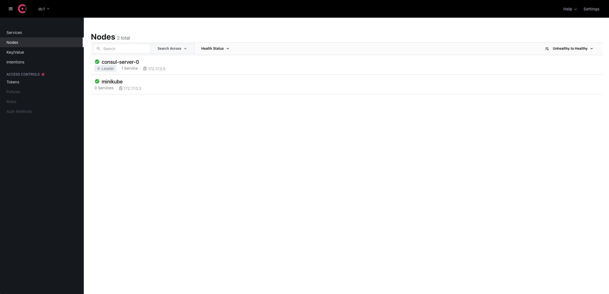
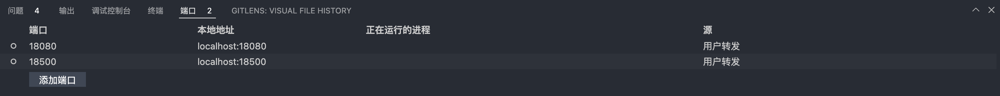
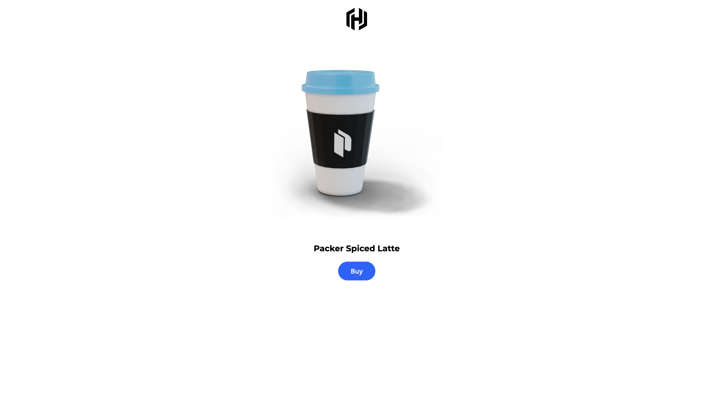
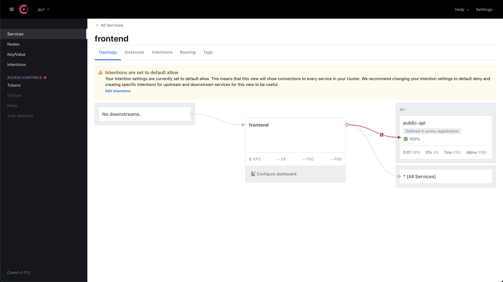
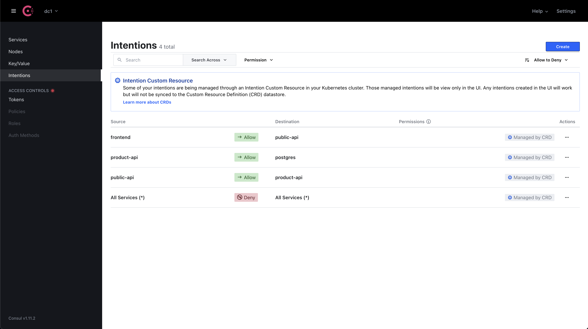

<!--more-->



## 服务网格

服务网格是为本地、云或混合云基础设施提供安全的*服务到服务*通信的专用层。服务网格通常与微服务架构模式一起使用，但可以在涉及复杂网络的任何场景中提供价值。

服务网格通常由控制平面和数据平面组成。控件平面维护一个中央注册表，可跟踪所有服务及其各自的 IP 地址，这被称为服务发现。只要应用程序在控制平面注册，控制平面就可以与服务网格的其他成员共享如何与应用程序通信并强制规定谁能彼此通信。

控制平面负责保护网格，促进服务发现、健康检查、策略执行和其他类似的操作问题。数据平面处理服务之间的通信。许多服务网格解决方案采用 sidecar 代理来处理数据平面通信，因此限制了服务对网络环境的感知水平。

## 服务发展

### 单体服务


flowchart TB
subgraph 服务
A-->B
B-->D
A-->C
C-->D
end


- 模块间函数调用，以纳秒为单位
- 参数传递，数据无需加密
- 导入模块，增加功能
- 子系统出现问题，得重新发布整个系统

### 微服务

为了提升开发效率，降低特性发布周期，开始走向微服务架构


graph LR
A(服务 A) -->B(服务 B)
B(服务 B) -->D(服务 D)
A(服务 A) -->C(服务 C)
C(服务 C) -->D(服务 D)


- 模块间网络调用，以毫秒为单位
- 数据在网络中传输，需要加密
- 访问 IP:Port 获取服务

挑战：

- 服务发现
- 服务配置
- 服务分界：外部，业务，数据
- 服务地址由负载均衡器（如 nginx）硬编码，微服务通过负载均衡器地址调用其依赖的服务

### 服务网格

- 服务发现：微服务服务在中央服务进行注册
- 服务配置：中央服务 K/V 数据库存储配置
- 服务分界：中央服务定义微服务之间的通信规则（Service Graph）
- 服务鉴权：不同的服务有不同的 TLS 证书，服务间进行双向 TLS 鉴权

sidecar proxy


graph LR
A(服务 A) -->PA(ProxyA)
PA -->PB(Proxy B)
PB -->B(服务 B)


## 部署 Consul

前置要求：

- [docker](https://docs.docker.com/get-started/overview/)
- [minikube](https://minikube.sigs.k8s.io/docs/)
- [helm](https://helm.sh/docs/)

1. 克隆示例存储库

```shell
git clone https://github.com/hashicorp/learn-consul-kubernetes.git --depth=1
```

2. 切换到教程目录

```shell
cd learn-consul-kubernetes/service-mesh/deploy
```

3. 添加 chart 仓库

```shell
helm repo add hashicorp https://helm.releases.hashicorp.com
```

4. 更新 chart 仓库

```shell
helm repo update
```

5. 部署 consul

```shell
helm install -f config.yaml consul hashicorp/consul --create-namespace -n consul --version "0.39.0"
```

6. 验证安装

```shell
kubectl get pods --namespace consul --selector app=consul
```

Output:

```text
NAME                                                         READY   STATUS    RESTARTS      AGE
consul-bz8xw                                                 1/1     Running   0             23m
consul-connect-injector-webhook-deployment-8d4f5c97b-56vk5   1/1     Running   1 (22m ago)   23m
consul-connect-injector-webhook-deployment-8d4f5c97b-lp9zh   1/1     Running   0             23m
consul-controller-7b588d978-2thrf                            1/1     Running   0             23m
consul-server-0                                              1/1     Running   0             23m
consul-webhook-cert-manager-78669db499-wnlq8                 1/1     Running   0             23m
```

7. 转发 UI 端口

```shell
kubectl --namespace consul port-forward service/consul-ui 18500:80 --address 0.0.0.0
```

这里推荐使用 VSCode Remote SSH，提供的端口转发功能可以轻易的访问服务器的服务。



## 更新 consul 配置

1. 修改 `config.yaml` 文件

```yaml
global:
  name: consul
  datacenter: dc1
  metrics:
    enabled: true
    enableAgentMetrics: true
  acls:
    manageSystemACLs: true
  gossipEncryption:
    autoGenerate: true
  tls:
    enabled: true
    enableAutoEncrypt: true
    verify: true

server:
  replicas: 1

ui:
  enabled: true

connectInject:
  enabled: true

controller:
  enabled: true

prometheus:
  enabled: true
```

2. 使用 helm 升级

```shell
helm upgrade consul hashicorp/consul --namespace consul --version "0.39.0" --values ./config.yaml --wait
```

3. 获取 ACL 令牌

```shell
kubectl get secrets/consul-bootstrap-acl-token -n consul --template='{{.data.token | base64decode }}'
```

## 部署微服务

1. 部署示例服务

依然是在刚刚的目录下，应用 hashicups 文件夹中的配置文件

```shell
kubectl apply -f hashicups/
```

Output:

```text
service/frontend created
serviceaccount/frontend created
servicedefaults.consul.hashicorp.com/frontend created
configmap/nginx-configmap created
deployment.apps/frontend created
service/postgres created
serviceaccount/postgres created
servicedefaults.consul.hashicorp.com/postgres created
deployment.apps/postgres created
service/product-api created
serviceaccount/product-api created
servicedefaults.consul.hashicorp.com/product-api created
configmap/db-configmap created
deployment.apps/product-api created
service/public-api created
serviceaccount/public-api created
servicedefaults.consul.hashicorp.com/public-api created
deployment.apps/public-api created
```

查看 pods

```shell
kubectl get pods --selector consul.hashicorp.com/connect-inject-status=injected
```

Output:

```text
NAME                           READY   STATUS    RESTARTS   AGE
frontend-699cb4546-vj78k       2/2     Running   0          25m
postgres-54966b4458-7gdk2      2/2     Running   0          25m
product-api-688d79df6c-fk7zw   2/2     Running   0          25m
public-api-5975bd4f4c-vkhrs    2/2     Running   0          25m
```

2. 转发服务端口

```shell
kubectl port-forward service/frontend 18080:80 --address 0.0.0.0
```



3. 浏览器打开 localhost:18080



## 配置零信任网络

1. 拒绝所有请求

进入 zero-trust-network 文件夹

```shell
cd service-mesh/zero-trust-network
```

应用规则

```shell
kubectl apply -f deny-all.yaml
```

2. 查看管理界面



访问 `http://127.0.0.1:18080/` 得到 `Error :(`

3. 允许特定服务间的通信

```shell
kubectl apply -f service-to-service.yaml
```

该文件允许下列请求的发生

- frontend -> public-api
- public-api -> product-api
- product-api -> postgres

查看管理界面



4. intention

intention 包含四个部分

- 源服务 - 指定发出请求的服务。它可以是一个服务的全称，也可以\*指代所有的服务。
- 目标服务 - 指定接收请求的服务。即在服务定义中配置的上游。它可以是一个服务的全称，也可以\*指代所有的服务。
- 权限 - 定义是否允许源和目标之间的通信。这可以设置为 allow 或 deny。
- 描述 - 可选，描述 intention 的字段。

```yaml
apiVersion: consul.hashicorp.com/v1alpha1
kind: ServiceIntentions
metadata:
  name: product-api-to-postgres
spec:
  destination:
    name: postgres
  sources:
    - name: product-api
      action: allow
```
