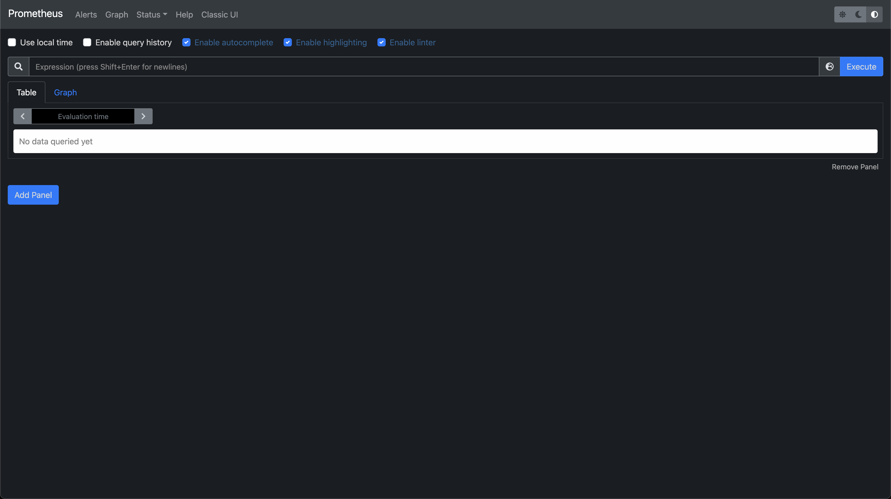

<!--more-->

## 微服务部署

创建一个示例 deployment 并在端口 8080 上公开它：

```shell
# 创建 deployment
kubectl create deployment hello-minikube --image=kicbase/echo-server:1.0
# 创建 service
kubectl expose deployment hello-minikube --type=NodePort --port=8080
```

或者编写 kustomize 文件

```yaml
# echo-app.yaml
---
apiVersion: apps/v1
kind: Deployment
metadata:
  name: echo-app # Deployment 的名字
  namespace: api # Deployment 所在命名空间
  labels:
    app: echo-app
spec:
  replicas: 2 # 该 Deployment 管理的 Pod 的副本数量
  selector: # 选中哪些 Pods
    matchLabels:
      app: echo-app
  template: # Pod 的参数
    metadata:
      labels:
        app: echo-app
    spec:
      containers:
        - image: echo-app:latest # 使用本地构建好的的镜像
          imagePullPolicy: IfNotPresent
          name: echo-app
          ports:
            - containerPort: 18080
---
apiVersion: v1
kind: Service
metadata:
  name: echo-app
  namespace: api
spec:
  type: LoadBalancer
  selector:
    app: echo-app
  ports:
    - name: api
      protocol: TCP
      port: 18080
      targetPort: 18080
```

应用到集群

```shell
kubectl apply -f echo-app.yaml
```

## Middleware

### Postgres

```yaml
# postgresql.yaml
---
global:
  postgresql:
    auth:
      postgresPassword: postgres

auth:
  username: guest
  password: "123456"
  database: mio
# 初始化脚本
# primary:
#   initdb:
#     scripts:
#       add_extension.sql: create extension if not exists "uuid-ossp";
```

```shell
helm install postgres bitnami/postgresql --values postgresql.yaml
```

### Redis

```yaml
# redis-cluster.yaml
---
global:
  redis:
    password: "123456"
```

```shell
helm install postgres bitnami/redis-cluster --values redis-cluster.yaml
```

### MQ

TODO

## APM

### jaeger

### uptrace

## Analysis

### ELK

### Prometheus

1. 安装 Prometheus Chart

```shell
helm install prometheus bitnami/kube-prometheus
```

Output:

```text
使用以下命令查看 Prometheus Operator Deployment 状态：

    kubectl get deploy -w --namespace default -l app.kubernetes.io/name=kube-prometheus-operator,app.kubernetes.io/instance=prometheus

使用以下命令查看 Prometheus StatefulSet 状态：

    kubectl get sts -w --namespace default -l app.kubernetes.io/name=kube-prometheus-prometheus,app.kubernetes.io/instance=prometheus

Prometheus 可以通过集群内以下 DNS 名称上的 9090 端口访问：

    prometheus-kube-prometheus-prometheus.default.svc.cluster.local

要从集群外部访问 Prometheus，请执行以下命令：

    echo "Prometheus URL: http://127.0.0.1:9090/"
    kubectl port-forward --namespace default svc/prometheus-kube-prometheus-prometheus 9090:9090

使用以下命令查看 Alertmanager StatefulSet 状态：

    kubectl get sts -w --namespace default -l app.kubernetes.io/name=kube-prometheus-alertmanager,app.kubernetes.io/instance=prometheus

可以通过集群内以下 DNS 名称上的 9093 端口访问 Alertmanager：

    prometheus-kube-prometheus-alertmanager.default.svc.cluster.local

要从集群外部访问 Alertmanager，请执行以下命令：

    echo "Alertmanager URL: http://127.0.0.1:9093/"
    kubectl port-forward --namespace default svc/prometheus-kube-prometheus-alertmanager 9093:9093
```

2. 转发 Prometheus 端口到本地

```shell
kubectl port-forward --namespace default svc/prometheus-kube-prometheus-prometheus 9090:9090
```

3. 浏览器打开 [http://127.0.0.1:9090](http://127.0.0.1:9090)



4. 配置 Prometheus 读取指标

TODO

5. 在 Prometheus GUI 查看指标

TODO

### Grafana

1. 安装 Grafana Chart

```shell
helm install grafana bitnami/grafana
```

Output:

```text
1. 通过运行以下命令获取应用程序 URL：

    echo "Browse to http://127.0.0.1:8080"
    kubectl port-forward svc/grafana 8080:3000 &

2. 获取管理员凭据：

    echo "User: admin"
    echo "Password: $(kubectl get secret grafana-admin --namespace default -o jsonpath="{.data.GF_SECURITY_ADMIN_PASSWORD}" | base64 --decode)"
```

2. 转发 Grafana UI 端口到本地

```shell
kubectl port-forward svc/grafana 8080:3000 &
```

3. 获取 Grafana 管理员密码

```shell
kubectl get secret grafana-admin --namespace default -o jsonpath={.data.GF_SECURITY_ADMIN_PASSWORD} | base64 --decode
```

4. 浏览器打开 [http://127.0.0.1:8080](http://127.0.0.1:8080)


