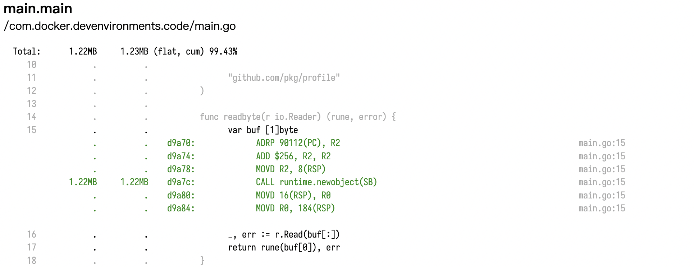

<!--more-->

## 1.6 Watch out for compiler optimisations

```go
package main

import "testing"

const (
	m1  = 0x5555555555555555
	m2  = 0x3333333333333333
	m4  = 0x0f0f0f0f0f0f0f0f
	h01 = 0x0101010101010101
)

func popcnt(x uint64) uint64 {
	x -= (x >> 1) & m1
	x = (x & m2) + ((x >> 2) & m2)
	x = (x + (x >> 4)) & m4
	return (x * h01) >> 56
}

func BenchmarkPopcnt(b *testing.B) {
	for i := 0; i < b.N; i++ {
		popcnt(uint64(i))
	}
}
```

```plaintext
goos: linux
goarch: arm64
BenchmarkPopcnt-4       1000000000               0.3202 ns/op
PASS
ok      command-line-arguments  0.361s
```

```go
package main

import "testing"

const (
	m1  = 0x5555555555555555
	m2  = 0x3333333333333333
	m4  = 0x0f0f0f0f0f0f0f0f
	h01 = 0x0101010101010101
)

func popcnt(x uint64) uint64 {
	x -= (x >> 1) & m1
	x = (x & m2) + ((x >> 2) & m2)
	x = (x + (x >> 4)) & m4
	return (x * h01) >> 56
}

var result uint64

func BenchmarkPopcnt(b *testing.B) {
	var r uint64
	for i := 0; i < b.N; i++ {
		r = popcnt(uint64(i))
	}
	result = r
}
```

```plaintext
goos: linux
goarch: arm64
BenchmarkPopcnt-4       1000000000               0.9192 ns/op
PASS
ok      command-line-arguments  1.026s
```

```go
package main

import "testing"

const (
	m1  = 0x5555555555555555
	m2  = 0x3333333333333333
	m4  = 0x0f0f0f0f0f0f0f0f
	h01 = 0x0101010101010101
)

func popcnt(x uint64) uint64 {
	x -= (x >> 1) & m1
	x = (x & m2) + ((x >> 2) & m2)
	x = (x + (x >> 4)) & m4
	return (x * h01) >> 56
}

var result uint64

func BenchmarkPopcnt(b *testing.B) {
	for i := 0; i < b.N; i++ {
		result = popcnt(uint64(i))
	}
}
```

```plaintext
goos: linux
goarch: arm64
BenchmarkPopcnt-4       1000000000               1.051 ns/op
PASS
ok      command-line-arguments  1.165s
```

## 2.5 Analysing a profile with pprof

### 2.5.2 CPU profiling

```go main.go
package main

import (
	"bufio"
	"fmt"
	"io"
	"log"
	"os"
	"unicode"
)

func readbyte(r io.Reader) (rune, error) {
	var buf [1]byte
	_, err := r.Read(buf[:])
	return rune(buf[0]), err
}

func main() {
	f, err := os.Open(os.Args[1])
	if err != nil {
		log.Fatalf("could not open file %q: %v", os.Args[1], err)
	}

	words := 0
	inword := false
	b := bufio.NewReader(f)
	for {
		r, err := readbyte(b)
		if err == io.EOF {
			break
		}
		if err != nil {
			log.Fatalf("could not read file %q: %v", os.Args[1], err)
		}
		if unicode.IsSpace(r) && inword {
			words++
			inword = false
		}
		inword = unicode.IsLetter(r)
	}
	fmt.Printf("%q: %d words\n", os.Args[1], words)
}
```

下载书籍 `wget https://www.gutenberg.org/files/2701/2701-0.txt && mv 2701-0.txt moby.txt`

```shell
time ./learning moby.txt
```

```plaintext
"moby.txt": 181320 words

real    0m0.057s
user    0m0.047s
sys     0m0.005s
```

```shell
time wc -w moby.txt
```

```plaintext
215864 moby.txt

real    0m0.021s
user    0m0.018s
sys     0m0.003s
```

### 2.5.3. Add CPU profiling

```go main.go
package main

import (
	"bufio"
	"fmt"
	"io"
	"log"
	"os"
	"unicode"

	"github.com/pkg/profile"
)

func readbyte(r io.Reader) (rune, error) {
	var buf [1]byte
	_, err := r.Read(buf[:])
	return rune(buf[0]), err
}

func main() {
	defer profile.Start(profile.CPUProfile, profile.ProfilePath(".")).Stop()

	f, err := os.Open(os.Args[1])
	if err != nil {
		log.Fatalf("could not open file %q: %v", os.Args[1], err)
	}

	words := 0
	inword := false
	b := bufio.NewReader(f)
	for {
		r, err := readbyte(b)
		if err == io.EOF {
			break
		}
		if err != nil {
			log.Fatalf("could not read file %q: %v", os.Args[1], err)
		}
		if unicode.IsSpace(r) && inword {
			words++
			inword = false
		}
		inword = unicode.IsLetter(r)
	}
	fmt.Printf("%q: %d words\n", os.Args[1], words)
}
```

```shell
time ./learning moby.txt
```

```plaintext
2022/09/08 18:23:26 profile: cpu profiling enabled, cpu.pprof
"moby.txt": 181320 words
2022/09/08 18:23:27 profile: cpu profiling disabled, cpu.pprof

real    0m0.217s
user    0m0.052s
sys     0m0.010s
```

```shell
go tool pprof cpu.pprof
```

```plaintext
File: learning
Type: cpu
Time: Sep 8, 2022 at 6:23pm (UTC)
Duration: 201.42ms, Total samples = 40ms (19.86%)
Entering interactive mode (type "help" for commands, "o" for options)
(pprof) top
Showing nodes accounting for 40ms, 100% of 40ms total
      flat  flat%   sum%        cum   cum%
      10ms 25.00% 25.00%       10ms 25.00%  runtime.getMCache (inline)
      10ms 25.00% 50.00%       10ms 25.00%  runtime.memmove
      10ms 25.00% 75.00%       10ms 25.00%  unicode.IsLetter (inline)
      10ms 25.00%   100%       10ms 25.00%  unicode.IsSpace
         0     0%   100%       10ms 25.00%  bufio.(*Reader).Read
         0     0%   100%       40ms   100%  main.main
         0     0%   100%       20ms 50.00%  main.readbyte (inline)
         0     0%   100%       40ms   100%  runtime.main
         0     0%   100%       10ms 25.00%  runtime.mallocgc
         0     0%   100%       10ms 25.00%  runtime.newobject
```

```shell
go tool pprof -http=:8080 cpu.pprof
```

```plaintext
Serving web UI on http://localhost:8080
```

### 2.5.4. Improving our version

```go main.go
package main

import (
	"bufio"
	"fmt"
	"io"
	"log"
	"os"
	"unicode"

	"github.com/pkg/profile"
)

func readbyte(r io.Reader) (rune, error) {
	var buf [1]byte
	_, err := r.Read(buf[:])
	return rune(buf[0]), err
}

func main() {
	defer profile.Start(profile.MemProfile, profile.MemProfileRate(1), profile.ProfilePath(".")).Stop()

	f, err := os.Open(os.Args[1])
	if err != nil {
		log.Fatalf("could not open file %q: %v", os.Args[1], err)
	}

	b := bufio.NewReader(f)
	words := 0
	inword := false
	for {
		r, err := readbyte(b)
		if err == io.EOF {
			break
		}
		if err != nil {
			log.Fatalf("could not read file %q: %v", os.Args[1], err)
		}
		if unicode.IsSpace(r) && inword {
			words++
			inword = false
		}
		inword = unicode.IsLetter(r)
	}
	fmt.Printf("%q: %d words\n", os.Args[1], words)
}
```

```shell
time ./learning moby.txt
```

```plaintext
2022/09/08 18:41:44 profile: memory profiling enabled (rate 1), mem.pprof
"moby.txt": 181320 words
2022/09/08 18:41:44 profile: memory profiling disabled, mem.pprof

real    0m0.140s
user    0m0.132s
sys     0m0.011s
```



TODO: 使用 sync.Pool 重用对象
