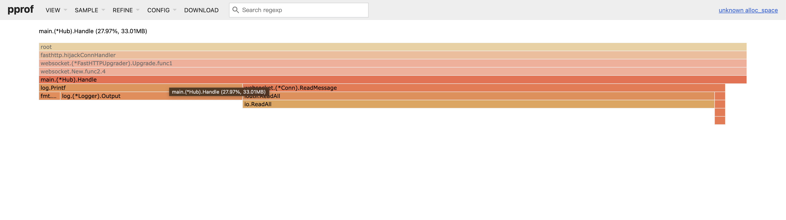
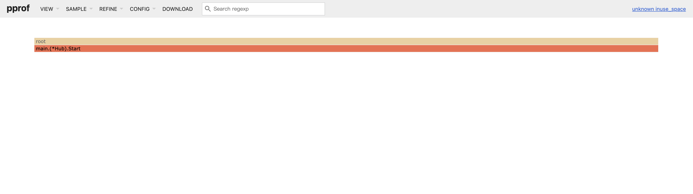

<!--more-->

## Server

源码[在这](https://github.com/saltfishpr/go-learning/blob/examples/websocket/cmd/server/main.go)

使用 [fiber](https://gofiber.io/) 框架搭建 web 服务器，处理 websocket 连接

`Hub` 用来保存和管理所有连接，这里使用 map 存储

```go
type Hub struct {
	registerCh   chan *websocket.Conn
	unregisterCh chan *websocket.Conn
	broadcastCh  chan []byte

	conns map[*websocket.Conn]bool
}
```

每隔 3s 向当前所有客户端发送广播消息

```go
	go func() {
		ticker := time.NewTicker(3 * time.Second)
		for {
			select {
			case <-ctx.Done():
				return
			case <-ticker.C:
				payload, _ := json.Marshal(map[string]string{
					"event":   "CHAT_MSG",
					"user":    "server",
					"message": "hello, this is server",
				})
				h.broadcastCh <- payload
			}
		}
	}()
```

每建立一个连接，就会开启一个 goroutine，将连接注册到 Hub 中，循环监听发来的消息，退出时注销并关闭连接

```go
func (h *Hub) Handle(c *websocket.Conn) {
	// When the function returns, unregister the client and close the connection
	defer func() {
		h.unregisterCh <- c
		c.Close()
	}()

	// Register the client
	h.registerCh <- c

	for {
		messageType, payload, err := c.ReadMessage()
		// ...
	}
}
```

## K6 压测

参考文档 https://k6.io/docs/examples/websockets/

- 客户端每 1-3s 就会向服务端发送消息
- 客户端 13s 后关闭连接
- 接收服务端传来的消息并打印

注：

- `export default function ()` 每次执行为一个 `iteration`，即一个迭代时长为 13s

```js
const sessionDuration = 10000; // 会话时长设置为 10000ms

export const options = {
  stages: [{ duration: "30s", target: 10000 }],
  minIterationDuration: "15s", // 一个 VU 执行一次迭代的最短时间，设置此值大于测试函数执行时间，保证函数能被正确执行完
};

export default function () {
  const url = "ws://localhost:3000/ws";
  const params = { tags: { my_tag: "hello" } };

  const res = ws.connect(url, params, function (socket) {
    socket.on("open", function open() {
      console.log(`VU ${__VU}: connected`);

      socket.send(
        JSON.stringify({ event: "SET_NAME", new_name: `Croc ${__VU}` })
      );

      socket.setInterval(function timeout() {
        socket.send(
          JSON.stringify({
            event: "SAY",
            message: `I'm saying ${randomString(5)}`,
          })
        );
      }, randomIntBetween(1000, 3000)); // 每隔 1-3s 发送随机字符串
    });

	// ...

    socket.setTimeout(function () {
      console.log(`VU ${__VU}: ${sessionDuration}ms passed, leaving the chat`);
      socket.send(JSON.stringify({ event: "LEAVE" }));
    }, sessionDuration); // 会话结束，发送离开消息，让服务端做出相应

    socket.setTimeout(function () {
      console.log(`Closing the socket forcefully 3s after graceful LEAVE`);
      socket.close();
    }, sessionDuration + 3000); // 达到连接时长最大值，关闭连接
  });

  check(res, { "Connected successfully": (r) => r && r.status === 101 });
}
```

压测结果

```plaintext
running (0m45.1s), 00000/10000 VUs, 15008 complete and 0 interrupted iterations
default ✓ [======================================] 00000/10000 VUs  30s

     ✓ Connected successfully

     checks................: 100.00% ✓ 15008       ✗ 0
     data_received.........: 7.2 MB  159 kB/s
     data_sent.............: 9.1 MB  201 kB/s
     iteration_duration....: avg=13.06s min=13s     med=13s      max=13.88s   p(90)=13.26s   p(95)=13.46s
     iterations............: 15008   332.710255/s
     vus...................: 416     min=130       max=9795
     vus_max...............: 10000   min=10000     max=10000
     ws_connecting.........: avg=2.51ms min=96.29µs med=283.37µs max=238.25ms p(90)=843.39µs p(95)=3.95ms
     ws_msgs_received......: 64824   1437.0742/s
     ws_msgs_sent..........: 129217  2864.593621/s
     ws_session_duration...: avg=13.06s min=13s     med=13s      max=13.88s   p(90)=13.26s   p(95)=13.46s
     ws_sessions...........: 15008   332.710255/s

```

从 Client 角度看

- ws_connecting: 建链耗时
- ws_msgs_received: 每秒接收消息
- ws_msgs_sent: 每秒发送消息

## 内存分析

```shell
go tool pprof -http=:8080 'localhost:3000/debug/pprof/heap?seconds=60'
```

**alloc_space**



**inuse_space**



- 10000 个连接总共分配了 33MB 的内存，每个连接约为 3.3KB
- 连接断开后仅占用 0.55MB 内存
